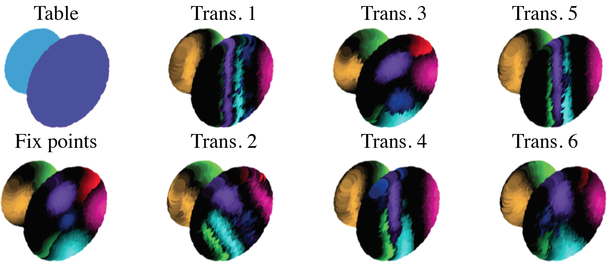

# Spatial Transformer for 3D Point Clouds

[[Project]](http://pwang.pw/spn.html) [[Paper]](https://arxiv.org/abs/1906.10887)   

## Overview
This is the author's re-implementation of the long-tail recognizer described in:  
"[Spatial Transformer for 3D Point Clouds](https://arxiv.org/abs/1906.10887)"   
[Jiayun Wang](http://pwang.pw/),&nbsp; [Rudrasis Chakraborty](https://rudra1988.github.io/),&nbsp; [Stella X. Yu](https://www1.icsi.berkeley.edu/~stellayu/)&nbsp; (UC Berkeley / ICSI)&nbsp; 
in arXiv 2019



Further information please contact [Jiayun Wang](mailto:peterwg@berkeley.edu).

## Update notifications
* 10/07/2019: Uploaded sampling-based methods for ShapeNet part segmentation.

## Requirements
* [PyTorch](https://pytorch.org/) (for the point-based method, version >= 0.4.1)
* [CAFFE](https://github.com/samaonline/spatial-transformer-for-3d-point-clouds/caffe-deform/) (for the sampling-based method, please use our version as we rewrite some source codes.)
* [NCCL](https://github.com/NVIDIA/nccl) (for multi-gpu in the sampling-based method)

## Sampling-based Methods

### Install Caffe

Please use [our version of CAFFE](https://github.com/samaonline/spatial-transformer-for-3d-point-clouds/caffe-deform/), as we provide the implementation of spatial transformers for bilateralNN, as described in the paper. A guide to CAFFE installation can be found [here](https://caffe.berkeleyvision.org/installation.html).

### Data Preparation

See instructions in [data/README.md](https://github.com/samaonline/spatial-transformer-for-3d-point-clouds/blob/master/sampling-based/data/README.md).

### Running Examples

    * ShapeNet Part segmentation
        * train and evaluate
            ```bash
            cd sampling-based/exp/shapenet3d
            ./train_test.sh
        * test trained model
            ```bash
            cd sampling-based/exp/shapenet3d
            ./test_only.sh
            ```
            Predictions are under `pred/`, with evaluation results in `test.log`.

## Benchmarks and Model Zoo

Please refer to Section 4 of the [paper](https://arxiv.org/abs/1906.10887).

## CAUTION
The code is implemented based on [Dynamic Graph CNN](https://github.com/WangYueFt/dgcnn), [BilateralNN](https://github.com/MPI-IS/bilateralNN) and [SplatNet](https://github.com/NVlabs/splatnet).

## License and Citation
The use of this software is RESTRICTED to **non-commercial research and educational purposes**.
```
@article{spn3dpointclouds,
  author    = {Jiayun Wang and
               Rudrasis Chakraborty and
               Stella X. Yu},
  title     = {Spatial Transformer for 3D Points},
  journal   = {CoRR},
  volume    = {abs/1906.10887},
  year      = {2019},
  url       = {http://arxiv.org/abs/1906.10887},
}
```
